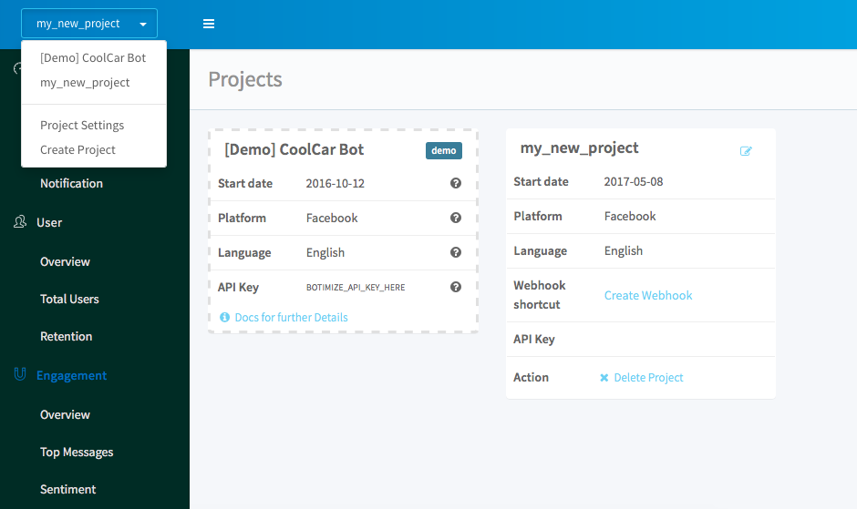

# Create your Facebook Messenger bot in python with botimize bot-analytics service

You can follow the [documentation](https://developers.facebook.com/docs/messenger-platform/guides/quick-start), where the Messagner team has prepared a clear guide written in node.js for the beginner.

Since the Messagner team only provides the node.js tutorial, here is our 15 minutes guide for **python** coder which include [botimize](http://www.botimize.io) **bot analytic** service.

## Get start

Messanger uses the web server to receive and send the message(text, emoji, pic). You need to have the authority to talk to the web service and then the bot have to approved by Facebook developer platform in order to speak the public.

You can easily git clone the whole project, setting up the dependency by running ```pip install -r requirements.txt```, and run the server somewhere else e.g. heroku.

## Create a heroku account
Sign up an heroku account at https://www.heroku.com.

## Set up the dependency

Create a requirements.txt and copy this into it.
```
appdirs==1.4.3
botimize==1.1
certifi==2017.4.17
click==6.7
Flask==0.12.1
future==0.16.0
gunicorn==19.7.1
itsdangerous==0.24
Jinja2==2.9.6
MarkupSafe==1.0
numpy==1.12.1
packaging==16.8
pyparsing==2.2.0
python-telegram-bot==5.3.0
requests==2.13.0
six==1.10.0
urllib3==1.20
Werkzeug==0.12.1
```

Install package by running
```
pip install -r requirements.txt
```

## Create your Facebook App and Page

First, go to [facebook developer dashboard](https://developers.facebook.com/apps)
Click [create new app](/demo/create_new_app.png) to create a new app or **Add new app** if you already have some apps exsiting.

In the project dashboard, click 


Then click **Messagner get start**


Generate **facebook_access_token**


Keep this very long **Facebook_Access_Token** in a notebook, very important!

## Create a botimize account and a key for the project

Go to [botimize](https://dashboard.botimize.io/register) and create an account.

Create a new project by clicking new project.


See your **Your_Botimize_Api_Key** by clicking Project Setting



## Create a python bot

Create a python script (e.g. botimize_echo.py) and copy this into it. 

Notice your have to replace **Your_Facebook_Access_Token** and **Your_Botimize_Api_Key**.

```
import os
import sys
import json

import requests
from botimize import Botimize
from flask import Flask, request

app = Flask(__name__)

Botimize_Api_Key = 'Your_Botimize_Api_Key'
FACEBOOK_ACCESS_TOKEN = 'Your_Facebook_Access_Token' 
botimize = Botimize(Botimize_Api_Key, 'facebook')

@app.route('/', methods=['GET'])
def verify():
    if request.args.get("hub.mode") == "subscribe" and request.args.get("hub.challenge"):
        if not request.args.get("hub.verify_token") == os.environ["testbot_verify_token"]:
            return "Verification token mismatch", 403
        return request.args["hub.challenge"], 200
    return "Hello world", 200

@app.route('/', methods=['POST'])
def webhook():
    data = request.get_json() # receive the message from facebook
    botimize.log_incoming(data) # send incoming message to botimize
    if data["object"] == "page":
        for entry in data["entry"]:
            for messaging_event in entry["messaging"]:
                if messaging_event.get("message") and messaging_event["message"].get("text"):
                    message_text = messaging_event["message"]["text"]
                    send_message(sender_id, message_text) # send response message to facebook
                    data_out = {
                        "access_token": FACEBOOK_ACCESS_TOKEN,
                        "message": messaging_event["message"],
                        "recipient": messaging_event["sender"]
                    }
                    botimize.log_outgoing(data_out) # send outgoging message to botimize
                else:
                    pass
    return "ok", 200

def send_message(recipient_id, message_text):
    params = {
        "access_token": FACEBOOK_ACCESS_TOKEN
    }
    headers = {
        "Content-Type": "application/json"
    }
    data = json.dumps({
        "recipient": {
            "id": recipient_id
        },
        "message": {
            "text": message_text
        }
    })
    r = requests.post("https://graph.facebook.com/v2.6/me/messages", params=params, headers=headers, data=data)

if __name__ == '__main__':
    app.run(debug=True)
```

## Create Procfile for heroku

Create a Procfile and copy this into it.

Notice you have to replace **botimize_echo** with your python script name.
```
web: gunicorn botimize_echo:app --log-file=-
```

## Commit to heroku

```bash
git init
git add .
git commmit -m "create a heroku project"
heroku create
git push heroku master
```
There will show a heroku-url on screen after you push to heroku.
Keep this Url (e.g. https://your_app_name.herokuapp.com).

## Talk to your bot

- Set up the webhook by pasting https://your_app_name.herokuapp.com into the field  and subscribe to your page. Your password for the webhook is **testbot_verify_token** which shows in the upper python script.


- Now you can talk to your bot by clicking the "Send Message" on the fan page of the facebook.


