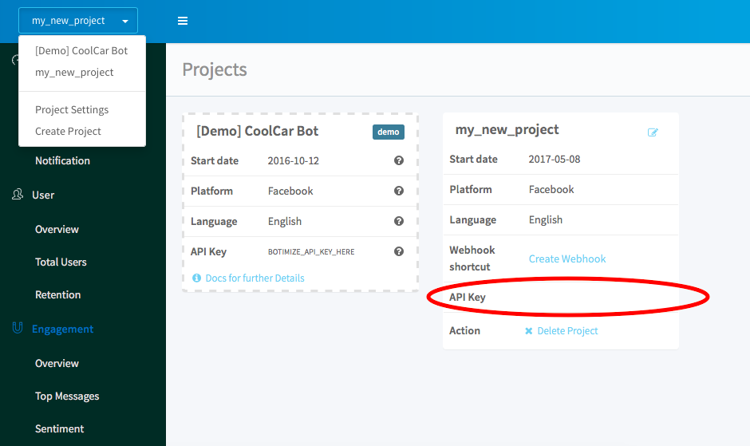

# Create your Facebook Messenger bot in python with botimize bot-analytics service

You can follow the [documentation](https://developers.facebook.com/docs/messenger-platform/guides/quick-start), where the Messagner team has prepared a clear guide written in node.js for the beginner.

Since the Messagner team only provides the node.js tutorial, here is our 15 minutes guide for **python** coder which include [botimize](http://www.botimize.io) **bot analytic** service.

## Get start

Messanger uses the web server to receive and send the message(text, emoji, pic). You need to have the authority to talk to the web service and then the bot have to approved by Facebook developer platform in order to speak the public.

You can easily git clone the whole project, setting up the dependency by running ```pip install -r requirements.txt```, and run the server somewhere else e.g. heroku.

## Create a heroku account
Sign up an heroku account at https://www.heroku.com.

## Set up the dependency

Create a requirements.txt and copy this into it.
```
apiai==1.2.3
appdirs==1.4.3
botimize==1.1
certifi==2017.4.17
click==6.7
Flask==0.12.1
future==0.16.0
gunicorn==19.7.1
itsdangerous==0.24
Jinja2==2.9.6
MarkupSafe==1.0
numpy==1.12.1
packaging==16.8
pyparsing==2.2.0
python-telegram-bot==5.3.0
requests==2.13.0
six==1.10.0
urllib3==1.20
Werkzeug==0.12.1
```

Install package by running
```
pip install -r requirements.txt
```

## Create your Facebook App and Page

First, go to [facebook developer dashboard](https://developers.facebook.com/apps)
Click [create new app](/demo/create_new_app.png) to create a new app or **Add new app** if you already have some apps exsiting.

In the project dashboard, click [Add project](/demo/add_project.png)

Then click **Messagner get start**


Generate **facebook_access_token**


Keep this very long **Facebook_Access_Token** in a notebook, very important!

## Create a botimize account and a key for the project

Go to [botimize](https://dashboard.botimize.io/register) and create an account.

Create a new project by clicking new project.


See your **Your_Botimize_Api_Key** by clicking Project Setting



## Create a python bot

Create a python file (e.g. botimize_echo.py) and copy this into it. 
Notice your have to replace **Your_Facebook_Access_Token** and **Your_Botimize_Api_Key**.

```
import os
import requests
from botimize import Botimize 
from flask import Flask, request
app = Flask(__name__)
 
FACEBOOK_ACCESS_TOKEN = "Your_Facebook_Access_Token"
Botimize_Api_Key = "Your_Botimize_Api_Key"
botimize = Botimize(Botimize_Api_Key, "facebook")
 
def reply(user_id, msg):
    data = {
        "recipient": {"id": user_id},
        "message": {"text": msg}
    }
    resp = requests.post("https://graph.facebook.com/v2.6/me/messages?access_token=" + FACEBOOK_ACCESS_TOKEN, json=data)
    return "ok"
@app.route('/', methods=['GET'])
def verify():
    return request.args['hub.challenge']
 
@app.route('/', methods=['POST'])
def handle_incoming_messages():
    # reply
    data_in = request.json
    sender = data_in['entry'][0]['messaging'][0]['sender']['id']
    message = data_in['entry'][0]['messaging'][0]['message']['text']
    reply(sender, message)
    # incoming
    botimize.log_incoming(data_in)
    #outgoing
    data_out = {
        "recipient": {"id": sender},
        "message": {"text": message}
    }
    botimize.log_outgoing(data_out)
    return "ok"
 
if __name__ == '__main__':
    app.run(debug=True)
```

## Create Procfile for heroku

Create a Procfile and copy this into it.
Notice you have to replace **botimize_echo** with your python file name.
```
web: gunicorn botimize_echo:app --log-file=-
```

## Commit to heroku

```
git init
git add .
git commmit -m "create a heroku project"
heroku create
git push heroku master
```

## Talk to your bot
Update the webhook url with heroku webhook.
